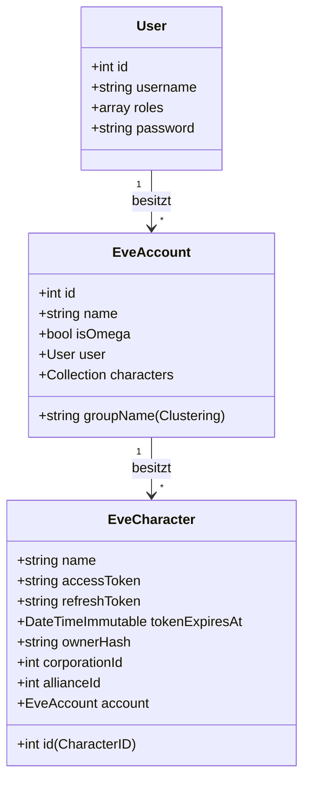

# Integrationsplan: EVE Online ESI API & SSO

Dieses Dokument beschreibt das Konzept und die einzelnen Schritte zur Anbindung der **EVE Online ESI API** sowie des **EVE SSO (OAuth 2.0)** in das Projekt `WH-Toolbox`.

---

## 1. Ordner für externe Dokumentation (`docs/`)

Um die API-Dokumentation lokal und versioniert vorzuhalten, erstellen wir einen neuen Ordner `docs/` im Projekt-Wurzelverzeichnis:

- **Pfad:** `docs/esi/`
- **Inhalt:** 
  - Die aktuelle ESI OpenAPI-Spezifikation (z. B. als `swagger.json` heruntergeladen von `https://esi.evetech.net/latest/swagger.json`).
  - Eigene Notizen zu verwendeten Scopes, Endpunkten und Datenstrukturen.
  - Dokumentation zum EVE SSO Ablauf.

> [!NOTE]
> Die ESI OpenAPI-Spezifikation kann direkt via `wget` oder `curl` in diesen Ordner geladen werden, um eine lokale Referenz zu haben.

---

## 2. EVE SSO (OAuth 2.0) Authentifizierung

Um auf charakterbezogene Daten zuzugreifen, müssen wir den OAuth 2.0 Authorization Code Flow implementieren.

### A. App-Registrierung
Im EVE Online Developer Portal (`https://developers.eveonline.com`) muss eine App registriert werden mit:
- **Scopes:** z. B. `esi-wallet.read_character_wallet.v1`, `esi-assets.read_assets.v1`
- **Callback URL:** z. B. `https://localhost/auth/eve/callback` oder `https://toolbox.corp/auth/eve/callback`

### B. Konfiguration in Symfony
Wir konfigurieren die Zugangsdaten in der `.env` bzw. `.env.local`:
```env
###> EVE SSO ###
EVE_SSO_CLIENT_ID=deine_client_id
EVE_SSO_SECRET_KEY=dein_secret_key
EVE_SSO_CALLBACK_URL=https://localhost/auth/eve/callback
###< EVE SSO ###
```

### C. Ablauf im Controller
1. **Redirect:** Der Benutzer klickt auf "EVE Charakter hinzufügen". Der Controller generiert einen sicheren `state` (Anti-CSRF), speichert ihn in der Session und leitet den User zu `https://login.eveonline.com/v2/oauth/authorize` mit den gewünschten Parametern weiter.
2. **Callback:** Nach erfolgreichem Login leitet EVE zurück zu `/auth/eve/callback?code=CODE&state=STATE`.
3. **Token-Austausch:** Wir validieren den `state`. Mit dem `code` senden wir eine POST-Anfrage an `https://login.eveonline.com/v2/oauth/token` (Basic Auth mit Client ID & Secret) und erhalten `access_token`, `refresh_token` und `expires_in`.
4. **Token-Validierung:** Wir rufen das JWKS von EVE ab oder decodieren den JWT-Payload, um die Character-Details zu erhalten:
   - `CharacterID` (Sub)
   - `CharacterName` (Name)
   - `CharacterOwnerHash` (Owner)
5. **Zuordnung:** Wir ordnen diesen Charakter dem aktuell eingeloggten Symfony-User zu.

---

## 3. Datenbank-Design: Entitäten `EveAccount` & `EveCharacter`

Um Charaktere nach Accounts zu gruppieren, führen wir eine zusätzliche Entität `EveAccount` ein. Ein Benutzer kann mehrere Accounts anlegen, und jeder Account kann bis zu 3 Charaktere besitzen.



### Eigenschaften der `EveAccount`-Entität:
- `id` (int, Auto-Increment)
- `name` (string): Benutzerdefinierter Name des Accounts (z. B. "Main Account", "Cynos 1").
- `isOmega` (boolean): Manuelles Flag für den Omega-Status.
- `groupName` (string, optional): Zum manuellen Clustern / Gruppieren für bessere Übersicht.
- `user` (ManyToOne -> `User`): Verknüpfung zum Webseiten-Benutzer.

### Eigenschaften der `EveCharacter`-Entität:
- `id` (bigint): Die eindeutige EVE Character ID (Primary Key, kein Auto-Increment).
- `name` (string): Name des Charakters.
- `accessToken` (text): Temporäres Token.
- `refreshToken` (text): Langlebiges Token zur Erneuerung.
- `tokenExpiresAt` (datetime_immutable).
- `ownerHash` (string): Sicherheitsprüfung bei Besitzerwechsel.
- `corporationId` / `allianceId` (integer, optional).
- `account` (ManyToOne -> `EveAccount`, nullable): Verknüpfung zum Eve-Account.

---

## 4. EsiClient Service & Endpunkt-Architektur

Wir nutzen Symfonys `HttpClientInterface` direkt und verzichten auf externe Bibliotheken, um die Anwendung schlank und zukunftssicher zu halten. Wir schreiben **keine** separate Klasse pro ESI-Endpunkt, sondern nutzen einen modularisierten Service-Ansatz:

1. **Zentraler Core-Client (`App\Service\Esi\EsiClient`):**
   - Verwaltet die Basis-URL (`https://esi.evetech.net/`).
   - Übernimmt die Header (User-Agent, Authorization mit Bearer-Token).
   - Prüft vor jeder authentifizierten Anfrage das Ablaufdatum des Tokens. Wenn abgelaufen, wird das Token automatisch erneuert, in der DB gespeichert und die Anfrage fortgesetzt.
   - Beachtet `Expires`-Header zur lokalen Cache-Steuerung (vermeidet unnötige API-Aufrufe).
   - Überwacht Ratenbegrenzungs-Fehler (`X-Esi-Error-Limit-Remain`).

2. **Themenspezifische API-Services:**
   Anstatt Hunderte Endpunkte abzubilden, implementieren wir gezielt nur die Services und Methoden, die benötigt werden:
   - **`EsiMarketService`**: z. B. `getMarketHistory(int $regionId, int $typeId)` zum Abrufen historischer Daten für Deine Preisverläufe.
   - **`EsiCharacterService`**: z. B. `getWalletBalance(EveCharacter $character)` oder `getAssets(EveCharacter $character)`.

---

## 5. Token Keep-Alive & Automatisierung (Cronjob / Command)

Um die EVE SSO-Verbindungen aktiv zu halten und die Preis-Historie regelmäßig zu aktualisieren, implementieren wir einen Symfony Console Command:

- **Command Name:** `app:esi:update`
- **Intervall:** Täglich (ausgeführt über System-Cron oder DDEV-Cron).
- **Aktionen:**
  1. **Token Refresh:** Der Command geht alle registrierten `EveCharacter`-Einträge durch. Er führt bei Bedarf (oder präventiv) einen Token-Refresh über das SSO durch, um sicherzustellen, dass die Verknüpfungen aktiv bleiben und nicht ablaufen.
  2. **Preishistorie abrufen:** Für die vom Benutzer ausgewählten Items werden die aktuellen historischen Marktdaten abgerufen und in einer lokalen Tabelle (`MarketPriceHistory`) gespeichert.

